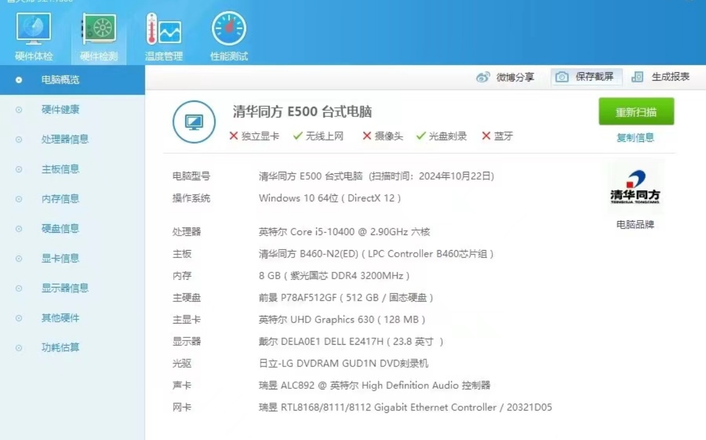

# 清华同方 E500-Hackintosh
### 版本
- macOS Sequoia
- macOS Ventura
- macOS Sonoma
- macOS Monterey
- macOS Big Sur
- macOS Catalina

### 具体配置如下：

| 类型          | 具体型号                            |
| ------------- | ----------------------------------- |
| **主板**      | **清华同方 B460-N2（ED）**           |
| **cpu**       | **i5 10400**                        |
| **显卡**      | **Intel UHD 630 ** |
| **网卡**      | **RTL8111**             |
| 内存          | 紫光 DDR4 3200 8G          |
| 硬盘          | 前景P78AF512GF                 |
| SMBIOS        | iMac19.2                    |

### 已测试可正常使用功能：

核显，网卡，声音，USB

### 注意事项

* 自行更换三码
* BIOS设置：安全启动，CSM，快速启动关掉，DVMT设置为64MB

